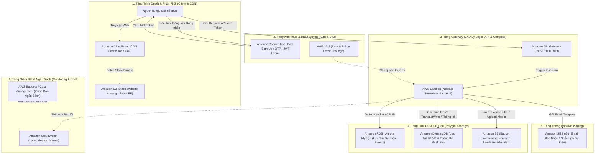

# BÁO CÁO GIỚI THIỆU TỔNG QUAN BÀI TẬP
## HỆ THỐNG QUẢN LÝ SỰ KIỆN & ĐĂNG KÝ THAM GIA SERVERLESS TRÊN AWS CLOUD

---

## 1. Giới thiệu Bài toán & Mục tiêu Đề tài

Trong kỷ nguyên chuyển đổi số và điện toán đám mây (Cloud Computing), việc xây dựng các ứng dụng có khả năng **mở rộng linh hoạt (Scalability)**, **độ sẵn sàng cao (High Availability)** và **tối ưu hóa chi phí vận hành (Cost Optimization)** là ưu tiên hàng đầu của các tổ chức và doanh nghiệp.

Đề tài **"Hệ thống Quản lý Sự kiện và Đăng ký Tham gia (Cloud Event & RSVP Management System)"** được thiết kế và triển khai nhằm giải quyết bài toán quản lý, quảng bá sự kiện và tiếp nhận lượng lớn người dùng đăng ký tham gia đồng thời trong các khung giờ cao điểm (flash traffic) mà không cần duy trì hệ thống máy chủ vật lý hay VPS truyền thống.

### Mục tiêu chính của hệ thống:
1. **Kiến trúc Serverless 100%**: Loại bỏ gánh nặng bảo trì hạ tầng máy chủ, tự động co giãn theo lưu lượng truy cập thực tế.
2. **Bảo mật & Xác thực phân quyền đa tầng**: Tích hợp xác thực tài khoản qua mã OTP, phân quyền truy cập chặt chẽ bằng chính sách bảo mật đám mây.
3. **Phân tách lưu trữ dữ liệu chuyên biệt (Polyglot Persistence)**: Kết hợp linh hoạt giữa cơ sở dữ liệu quan hệ (RDBMS) và cơ sở dữ liệu phi quan hệ (NoSQL) để tối ưu hiệu năng đọc/ghi.
4. **Trải nghiệm người dùng mượt mà & phân phối toàn cầu**: Tăng tốc độ tải trang và phản hồi API thông qua mạng lưới CDN toàn cầu.
5. **Giám sát toàn diện & Kiểm soát chi phí**: Theo dõi thời gian thực tình trạng hệ thống, lỗi vận hành và ngân sách chi tiêu trên AWS.

---

## 2. Kiến trúc Tổng thể Hệ thống (Architecture Overview)

Hệ thống được tổ chức theo mô hình **Kiến trúc Không máy chủ Đa tầng (Multi-tier Serverless Architecture)**:

---

## 3. Vai trò của 11 Dịch vụ AWS Trong Hệ thống

| STT | Dịch vụ AWS | Phân loại | Vai trò & Ứng dụng cụ thể trong đề tài |
| :---: | :--- | :--- | :--- |
| **1** | **AWS Budgets / Cost Management** | Quản trị chi phí | Thiết lập ngân sách trần cho đồ án (vd: $10 - $20/tháng), theo dõi chi phí theo từng dịch vụ, tự động gửi cảnh báo email khi chi phí chạm ngưỡng 80% và 100%. |
| **2** | **AWS IAM (Identity and Access Management)** | Bảo mật & Phân quyền | Quản lý người dùng, tạo IAM Execution Role cho Lambda với nguyên tắc cấp quyền tối thiểu (*Least Privilege*): chỉ cho phép đọc/ghi vào đúng bảng DynamoDB, RDS Secret, S3 Bucket và SES Identity. |
| **3** | **Amazon Aurora / RDS (MySQL)** | Cơ sở dữ liệu quan hệ | Lưu trữ dữ liệu có cấu trúc và mối quan hệ chặt chẽ: Thông tin chi tiết sự kiện (`events`), bao gồm `event_id`, tiêu đề, mô tả, thời gian bắt đầu, địa điểm, link ảnh bìa `banner_url`, và ngày tạo. |
| **4** | **Amazon DynamoDB** | Cơ sở dữ liệu NoSQL | Lưu trữ lượng lớn dữ liệu đăng ký tham gia (`event-rsvp-responses`) với độ trễ dưới 10ms. Hỗ trợ cơ chế `TransactWriteItems` đảm bảo tính toàn vẹn (ACID) khi đồng thời ghi nhận người tham gia và tự động tăng số lượng thống kê phản hồi (*Yes / No*). |
| **5** | **AWS Lambda** | Điện toán Serverless | Đóng vai trò là toàn bộ Backend xử lý nghiệp vụ trung tâm (Node.js). Tự động chạy mã nguồn khi có request, co giãn tức thì từ 0 lên hàng nghìn request/giây và tắt hoàn toàn khi không có người dùng, giúp tiết kiệm 100% chi phí máy chủ nhàn rỗi. |
| **6** | **Amazon API Gateway** | Quản lý API | Đóng vai trò làm cổng giao tiếp trung gian duy nhất giữa Client và Lambda. Định tuyến các route (`/events`, `/rsvp`, `/upload-url`, `/auth/*`, `/send-email`), xử lý CORS, kiểm soát rate limit và bảo vệ backend trước tấn công. |
| **7** | **Amazon S3 (Simple Storage Service)** | Lưu trữ Object | - **Bucket 1**: Lưu trữ toàn bộ mã nguồn build static của Frontend (HTML/CSS/JS). - **Bucket 2** (`tuantm-assets-bucket`): Lưu trữ các tệp tin media (Ảnh bìa sự kiện & Avatar người đăng ký) với cơ chế phân quyền public read. |
| **8** | **Amazon CloudFront** | Mạng phân phối nội dung (CDN) | Đặt trước S3 Frontend để cache toàn cầu, giảm tải cho S3, hỗ trợ giao thức HTTPS với chứng chỉ SSL, giúp người dùng tải giao diện ứng dụng với độ trễ cực thấp tại các điểm biên (Edge Locations). |
| **9** | **Amazon CloudWatch** | Giám sát & Ghi log | Tự động thu thập toàn bộ nhật ký (Execution Logs, `console.log`) từ Lambda, theo dõi các chỉ số quan trọng (Invocations, Duration, Error Rate), hỗ trợ gỡ lỗi và thiết lập Alarms cảnh báo lỗi hệ thống. |
| **10** | **Amazon SES (Simple Email Service)** | Dịch vụ Email | Tự động gửi email xác nhận tham gia sự kiện, vé điện tử và gửi thông báo hàng loạt đến danh sách người tham gia theo từng sự kiện. |
| **11** | **Amazon Cognito** | Quản lý danh tính người dùng | Quản lý vòng đời tài khoản Ban tổ chức và người dùng: Đăng ký (Sign Up), gửi mã OTP 6 số qua email để kích hoạt tài khoản, Đăng nhập (Sign In) và cấp phát JWT Tokens (IdToken, AccessToken, RefreshToken) an toàn. |

---

## 4. Các Luồng Nghiệp Vụ Chính Trong Hệ Thống

### 4.1. Luồng Xác thực Tài khoản (Cognito + SES)
1. Người dùng nhập Email, Tên và Mật khẩu tại giao diện Frontend.
2. Frontend gọi API Cognito `SignUpCommand` $\rightarrow$ Cognito tự động gửi mã OTP 6 số qua Email.
3. Người dùng nhập mã OTP $\rightarrow$ Frontend gọi `ConfirmSignUpCommand` để kích hoạt tài khoản.
4. Khi đăng nhập, Cognito trả về bộ JWT Tokens lưu tại Client để bảo vệ các thao tác quản trị sự kiện.

### 4.2. Luồng Quản lý Sự kiện (CRUD Events - RDS MySQL)
1. Ban tổ chức tạo/sửa sự kiện kèm ảnh banner.
2. Request đi qua **API Gateway** $\rightarrow$ **AWS Lambda** mở kết nối đến **RDS MySQL**.
3. Dữ liệu sự kiện được lưu trữ và truy vấn nhanh chóng với chuẩn thời gian ISO và cấu trúc quan hệ.

### 4.3. Luồng Đăng ký Tham gia & Tải ảnh Avatar (DynamoDB + S3 Presigned URL)
1. Người dùng chọn sự kiện, nhập Họ tên, Email, chọn trạng thái tham gia (*Yes/No*) và chọn ảnh đại diện.
2. **Tải ảnh**: Frontend xin `Presigned URL` từ Lambda qua `POST /upload-url` và đẩy trực tiếp ảnh lên **S3 Bucket**, nhận lại link ảnh S3.
3. **Lưu đăng ký**: Frontend gửi thông tin lên `POST /rsvp`. Lambda sử dụng giao dịch **DynamoDB TransactWriteItems**:
   - Ghi bản ghi người tham gia `RESPONDENT#email` (chặn trùng lặp email).
   - Nguyên tử cập nhật bộ đếm phản hồi `RESPONSE#Yes` / `RESPONSE#No`.

### 4.4. Luồng Gửi Email Thông báo Tự động (Amazon SES)
1. Sau khi ghi nhận đăng ký hoặc khi ban tổ chức muốn gửi thư mời:
2. Lambda đọc danh sách email và nội dung sự kiện $\rightarrow$ Gọi lệnh `SendEmailCommand` của **Amazon SES** $\rightarrow$ Gửi thư tức thì đến hòm thư người nhận.

---

## 5. Kết luận & Điểm nổi bật của Đề tài

1. **Hiệu năng & Khả năng chịu tải vượt trội**: Kiến trúc Serverless kết hợp DynamoDB và S3 Presigned URL giải phóng hoàn toàn gánh nặng xử lý I/O tốn kém trên server.
2. **Tính thực tiễn cao**: Ứng dụng giải quyết bài toán thực tế của các hội thảo, sự kiện quy mô lớn với đầy đủ tính năng xác thực OTP, đăng ký online, vé email và bảng điều khiển thống kê trực quan.
3. **Tuân thủ Chuẩn Best Practices của AWS**:
   - Kiến trúc phi tập trung (Decoupled Architecture).
   - An ninh đa lớp với IAM Least Privilege & Cognito User Pools.
   - Tối ưu hóa chi phí với Pay-as-you-go và AWS Budgets.
